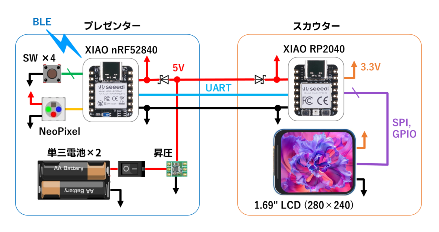

# カンペスカウター
PowerPointのノート(カンペ)を単眼式グラスに映します。また、スライド送りなどの操作もできます。

## システム構成

## 解説
* https://protopedia.net/prototype/7603

## ファイル
* [firmware/scouter](./firmware/scouter/) : スカウターのファームウェアのソースコード
* [firmware/presenter](./firmware/presenter/) : プレゼンターのファームウェアのソースコード
* [mechanical/scouter](./mechanical/scouter/) : スカウターの筐体設計データ
* [mechanical/presenter](./mechanical/presenter/) : プレゼンターの筐体設計データ
* [service](./service/) : PC側のサービスのソースコード (Python)
* [docs/circuit.md](docs/circuit.md) : 回路の資料
* [docs/BOM.md](docs/BOM.md) : おもな部品リスト
